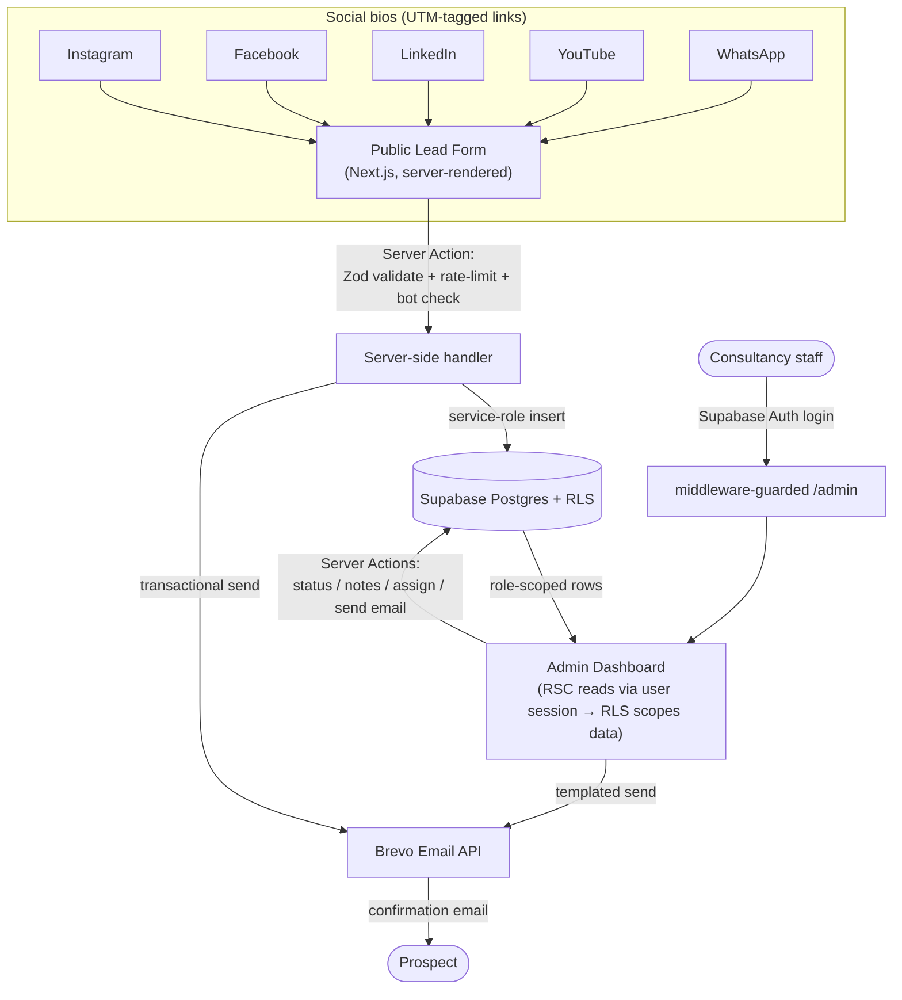
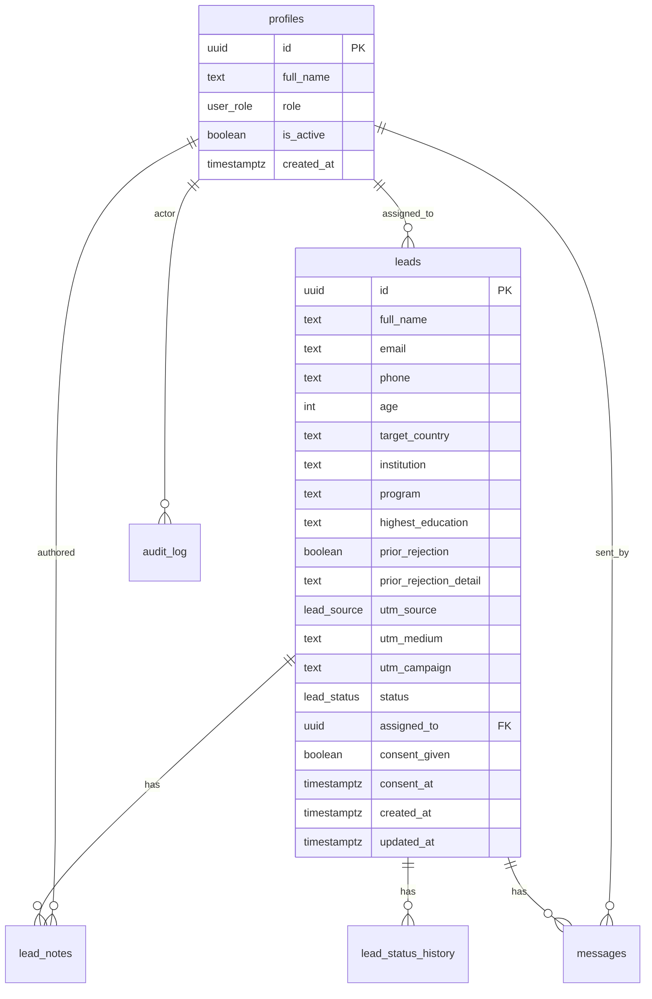

# Visa Consultancy CRM — MVP Build Specification

**Document type:** Authoritative architecture + setup guide for development
**Audience:** Claude Code (executor) and the engineering owner
**Version:** MVP v1.0 · June 2026
**Status:** Ready to build

---

## 0. How to use this document (read first)

This is the single source of truth for building the MVP. It is written so that an AI coding agent (Claude Code) can execute it end‑to‑end with minimal ambiguity.

**Rules for the executor:**

1. Read this entire document before writing any code.
2. Build in the **phase order** in §16. Each phase is independently shippable and testable.
3. The **data model (§7)** and **security rules (§8)** are non‑negotiable. Do not deviate without flagging it.
4. When building any UI, consult the `frontend-design` skill for visual direction. Use the design tokens in §10.
5. Never place a service‑role key, email API key, or any secret in client‑side code or a `NEXT_PUBLIC_*` variable.
6. Treat every field marked **(confirm)** in §19 as provisional — implement the sensible default given here and surface it for confirmation.

---

## 1. Project context & goal

This is a CRM for a **study‑abroad / student‑visa consultancy**. The consultancy receives prospective‑client inquiries across five social platforms (Instagram, Facebook, LinkedIn, YouTube, WhatsApp) and currently manages them manually across scattered tools.

**MVP purpose:** deliver a usable, production‑grade system the client can operate and validate in the real world. Once approved, it expands into the full CRM (social chatbot, WhatsApp bulk messaging, advanced analytics) — **on the same codebase, with no throwaway work**.

**This MVP deliberately excludes the chatbot.** The universal lead‑capture form does all the work: a UTM‑tagged form link sits in each social bio, and every submission lands in the dashboard with its source already attributed. That is enough to prove the capture‑and‑manage loop and earn sign‑off.

---

## 2. MVP scope — in and out

### In scope

- **Public lead‑capture form** — one professional, mobile‑first form; 10 fields + consent; invisible per‑platform source tracking via UTM parameters.
- **Source tracking** — each social bio gets its own UTM‑tagged link to the same form (see table in §10.6).
- **Lead database** — Supabase Postgres with Row‑Level Security on every table.
- **Staff authentication** — Supabase Auth; two roles, **Admin** and **Agent**, enforced in the database (not just the UI).
- **Admin dashboard** — leads table (search / filter / sort / server‑side pagination), lead detail with status pipeline, append‑only notes, status history, agent assignment, and analytics.
- **Email outreach (Brevo, free tier)** — automatic confirmation email to the lead on submit; staff‑triggered templated email sends from a lead's profile; **every send logged**.
- **Audit logging** — sensitive actions (status changes, message sends, assignments, logins) recorded.
- **Security & privacy** — baked in from day one (see §8 and §9).

### Out of scope (deferred to the full CRM — see §17)

- Social chatbot (ManyChat / IG + FB DMs).
- WhatsApp messaging (WATI) — requires a **paid plan and Meta template approval**, so it cannot be part of a free MVP.
- A separate Node/Railway webhook service — there are no external webhooks in the MVP; it slots in cleanly when the chatbot arrives.
- Document uploads, payments, multi‑tenant support, SLA automation, advanced reporting.

---

## 3. Architecture overview

### Shape

A **single full‑stack Next.js application** (App Router) deployed on **Vercel**, backed by **Supabase** (Postgres + Auth + Row‑Level Security), with **Brevo** for transactional email.



### Why this architecture (so you can defend it to the client)

- **One app, not three services.** With no external chatbot webhooks in the MVP, a separate Node/Railway backend has nothing to do. Fewer moving parts means higher reliability, a smaller attack surface, and lower cost. Next.js server actions and route handlers run on Vercel's auto‑scaling serverless infrastructure — production‑grade and stateless by default.
- **It does not contradict the pitch — it sequences it.** The pitch's webhook‑ingestion service exists to receive chatbot events. When that phase begins, we add a dedicated Next.js route handler or a separate worker service then, with a queue if volume warrants. The data model already accommodates it.
- **The MVP codebase is the CRM codebase.** Same Next.js app, same Supabase schema. Phase 2 adds modules; it does not rebuild.
- **Defense in depth.** Public form writes go through the server only (the browser never touches the database directly). Dashboard reads run under the signed‑in user's session so RLS filters rows automatically. Two independent guardrails — application authorization checks *and* database RLS — protect every record.

---

## 4. Technology stack

| Layer | Choice | Why |
|---|---|---|
| Framework | **Next.js (App Router), TypeScript (strict)** | Full‑stack in one repo; RSC for reads, Server Actions for writes; grows into the full CRM. |
| UI | **Tailwind CSS + shadcn/ui**, `lucide-react` icons | Fast, accessible, professional; consistent component primitives. |
| Charts | **Recharts** | Lightweight analytics (volume, source breakdown, pipeline). |
| Validation | **Zod** | One schema shared by client and server; the security boundary. |
| Database / Auth | **Supabase** (Postgres, Auth, RLS) | Managed Postgres with row‑level security and built‑in auth; free tier handles the MVP comfortably. |
| Email | **Brevo** transactional API | Free tier (verify current daily limit before launch); good deliverability. |
| Bot protection | **Cloudflare Turnstile** + honeypot field | Privacy‑friendly CAPTCHA alternative; blocks form spam. |
| Rate limiting | **Upstash Redis** (REST) — optional; in‑memory fallback for local | Protects the public form and auth endpoints from abuse. |
| Hosting | **Vercel** (app) + **Supabase** (DB) | Auto‑scaling, free tiers, HTTPS by default. |
| Package manager | **pnpm** | Fast, disk‑efficient. |
| Quality | **ESLint, Prettier, Vitest, Playwright** | Linting, unit, and end‑to‑end tests. |

> Use the latest stable versions at build time. Pin versions in `package.json` and commit the lockfile. Verify all third‑party free‑tier limits (Brevo, Supabase, Upstash) against current provider docs before go‑live; figures move.

---

## 5. Repository structure

```
visa-crm/
├─ app/
│  ├─ (public)/
│  │  ├─ apply/
│  │  │  ├─ page.tsx              # public lead-capture form
│  │  │  └─ actions.ts            # submitLead server action
│  │  └─ thank-you/page.tsx       # post-submit success
│  ├─ (admin)/
│  │  ├─ layout.tsx               # auth guard + dashboard shell
│  │  ├─ dashboard/page.tsx       # overview metrics + charts
│  │  ├─ leads/
│  │  │  ├─ page.tsx              # leads table (filter/search/paginate)
│  │  │  ├─ [id]/page.tsx         # lead detail
│  │  │  └─ actions.ts            # status/notes/assign/sendEmail actions
│  │  ├─ agents/page.tsx          # admin only: manage staff
│  │  └─ templates/page.tsx       # admin only: email templates
│  ├─ login/page.tsx
│  ├─ api/health/route.ts         # uptime check
│  ├─ layout.tsx
│  └─ globals.css
├─ components/
│  ├─ ui/                         # shadcn primitives
│  ├─ form/                       # form fields, consent, turnstile
│  ├─ dashboard/                  # tables, cards, lead detail panels
│  └─ charts/                     # recharts wrappers
├─ lib/
│  ├─ supabase/
│  │  ├─ client.ts                # browser client (auth only, anon key)
│  │  ├─ server.ts                # RSC/action client bound to user session
│  │  └─ service.ts               # SERVICE ROLE client (server only)
│  ├─ email/brevo.ts              # transactional send + logging
│  ├─ validation/lead.ts          # Zod schemas (shared)
│  ├─ security/
│  │  ├─ rate-limit.ts
│  │  └─ turnstile.ts
│  ├─ auth/guards.ts              # requireUser / requireRole helpers
│  ├─ audit.ts                    # writeAuditLog helper
│  └─ utils.ts
├─ supabase/
│  ├─ migrations/0001_init.sql    # schema + RLS + indexes + triggers
│  └─ seed.sql                    # enum-safe seed: first admin, templates
├─ tests/
│  ├─ unit/                       # vitest
│  └─ e2e/                        # playwright
├─ middleware.ts                  # session refresh + /admin protection
├─ .env.example
├─ next.config.mjs                # security headers
├─ tailwind.config.ts
├─ package.json
├─ tsconfig.json
└─ README.md
```

---

## 6. Environment variables

Create `.env.example` (committed) and `.env.local` (gitignored). **Anything without the `NEXT_PUBLIC_` prefix must never reach the browser.**

```bash
# ---- Public (safe to expose to the browser) ----
NEXT_PUBLIC_SUPABASE_URL=
NEXT_PUBLIC_SUPABASE_ANON_KEY=
NEXT_PUBLIC_APP_URL=https://crm.yourdomain.com
NEXT_PUBLIC_TURNSTILE_SITE_KEY=

# ---- Server only (NEVER expose; no NEXT_PUBLIC_ prefix) ----
SUPABASE_SERVICE_ROLE_KEY=        # bypasses RLS — server actions only
TURNSTILE_SECRET_KEY=
BREVO_API_KEY=
BREVO_SENDER_EMAIL=apply@yourdomain.com
BREVO_SENDER_NAME=Visa Consultancy

# ---- Optional (rate limiting; falls back to in-memory locally) ----
UPSTASH_REDIS_REST_URL=
UPSTASH_REDIS_REST_TOKEN=
```

**Guardrails:**
- The service‑role client (`lib/supabase/service.ts`) is imported **only** by server actions / route handlers. Add an ESLint rule or a runtime `import 'server-only'` guard to enforce this.
- `.env.local` is in `.gitignore`. Secrets live in the Vercel and Supabase dashboards for deployed environments, never in git.

---

## 7. Data model

### Entity relationships



### Full schema — `supabase/migrations/0001_init.sql`

```sql
-- =========================================================
-- ENUMS
-- =========================================================
create type user_role     as enum ('admin', 'agent');
create type lead_status    as enum ('new','contacted','in_progress','accepted','rejected','follow_up');
create type lead_source    as enum ('instagram','facebook','linkedin','youtube','whatsapp','direct','other');
create type message_channel as enum ('email');           -- 'whatsapp' added in full CRM
create type message_status  as enum ('queued','sent','failed');

-- =========================================================
-- PROFILES  (extends Supabase auth.users)
-- =========================================================
create table profiles (
  id          uuid primary key references auth.users(id) on delete cascade,
  full_name   text not null,
  role        user_role not null default 'agent',
  is_active   boolean not null default true,
  created_at  timestamptz not null default now()
);

-- Auto-create a profile when a new auth user is created.
-- Role defaults to 'agent'; promote the first user to 'admin' in seed.sql.
create function public.handle_new_user()
returns trigger language plpgsql security definer set search_path = public as $$
begin
  insert into public.profiles (id, full_name, role)
  values (new.id, coalesce(new.raw_user_meta_data->>'full_name', new.email), 'agent');
  return new;
end; $$;

create trigger on_auth_user_created
  after insert on auth.users
  for each row execute function public.handle_new_user();

-- =========================================================
-- LEADS
-- =========================================================
create table leads (
  id                    uuid primary key default gen_random_uuid(),
  full_name             text not null,
  email                 text not null,
  phone                 text not null,
  age                   int  check (age between 14 and 120),
  target_country        text,
  institution           text,
  program               text,
  highest_education     text,
  prior_rejection       boolean default false,
  prior_rejection_detail text,
  utm_source            lead_source not null default 'direct',
  utm_medium            text not null default 'direct',
  utm_campaign          text,
  status                lead_status not null default 'new',
  assigned_to           uuid references profiles(id) on delete set null,
  consent_given         boolean not null default false,
  consent_at            timestamptz,
  created_at            timestamptz not null default now(),
  updated_at            timestamptz not null default now()
);

create index idx_leads_status      on leads(status);
create index idx_leads_source       on leads(utm_source);
create index idx_leads_assigned     on leads(assigned_to);
create index idx_leads_created       on leads(created_at desc);
create index idx_leads_email         on leads(lower(email));

-- =========================================================
-- LEAD NOTES  (append-only)
-- =========================================================
create table lead_notes (
  id         uuid primary key default gen_random_uuid(),
  lead_id    uuid not null references leads(id) on delete cascade,
  author_id  uuid not null references profiles(id),
  body       text not null,
  created_at timestamptz not null default now()
);
create index idx_notes_lead on lead_notes(lead_id, created_at desc);

-- =========================================================
-- STATUS HISTORY  (pipeline audit)
-- =========================================================
create table lead_status_history (
  id          uuid primary key default gen_random_uuid(),
  lead_id     uuid not null references leads(id) on delete cascade,
  from_status lead_status,
  to_status   lead_status not null,
  changed_by  uuid references profiles(id),
  changed_at  timestamptz not null default now()
);
create index idx_history_lead on lead_status_history(lead_id, changed_at desc);

-- =========================================================
-- MESSAGES  (every outbound send is logged)
-- =========================================================
create table messages (
  id                  uuid primary key default gen_random_uuid(),
  lead_id             uuid not null references leads(id) on delete cascade,
  channel             message_channel not null default 'email',
  template_key        text,
  subject             text,
  body                text,
  status              message_status not null default 'queued',
  provider_message_id text,
  error_detail        text,
  sent_by             uuid references profiles(id),   -- null = system (auto confirmation)
  created_at          timestamptz not null default now()
);
create index idx_messages_lead on messages(lead_id, created_at desc);

-- =========================================================
-- EMAIL TEMPLATES  (editable by admin)
-- =========================================================
create table email_templates (
  key        text primary key,        -- 'welcome','acceptance','rejection','follow_up','document_request'
  name       text not null,
  subject    text not null,
  body       text not null,           -- supports {{full_name}}, {{program}} etc.
  is_auto    boolean not null default false,
  updated_at timestamptz not null default now()
);

-- =========================================================
-- AUDIT LOG
-- =========================================================
create table audit_log (
  id         uuid primary key default gen_random_uuid(),
  actor_id   uuid references profiles(id),
  action     text not null,           -- 'status_change','message_sent','lead_assigned','login', etc.
  entity     text not null,           -- 'lead','message','profile'
  entity_id  uuid,
  metadata   jsonb,
  created_at timestamptz not null default now()
);
create index idx_audit_created on audit_log(created_at desc);

-- =========================================================
-- updated_at trigger
-- =========================================================
create function public.touch_updated_at()
returns trigger language plpgsql as $$
begin new.updated_at = now(); return new; end; $$;

create trigger trg_leads_touch before update on leads
  for each row execute function public.touch_updated_at();
```

### Row‑Level Security policies

```sql
-- Enable RLS everywhere (deny-by-default once enabled).
alter table profiles            enable row level security;
alter table leads               enable row level security;
alter table lead_notes          enable row level security;
alter table lead_status_history enable row level security;
alter table messages            enable row level security;
alter table email_templates     enable row level security;
alter table audit_log           enable row level security;

-- Helper: is the current user an admin?
create function public.is_admin() returns boolean
language sql stable security definer set search_path = public as $$
  select exists(select 1 from profiles where id = auth.uid() and role = 'admin' and is_active);
$$;

-- ---------- PROFILES ----------
create policy profiles_self_read   on profiles for select using (id = auth.uid() or public.is_admin());
create policy profiles_admin_write on profiles for all
  using (public.is_admin()) with check (public.is_admin());

-- ---------- LEADS ----------
-- Admin: full access. Agent: only leads assigned to them.
-- NOTE: there is intentionally NO insert policy for authenticated users.
--       Public form inserts run server-side with the service role.
create policy leads_read on leads for select
  using (public.is_admin() or assigned_to = auth.uid());
create policy leads_update on leads for update
  using (public.is_admin() or assigned_to = auth.uid())
  with check (public.is_admin() or assigned_to = auth.uid());
create policy leads_admin_delete on leads for delete using (public.is_admin());

-- ---------- LEAD NOTES ----------
create policy notes_read on lead_notes for select using (
  public.is_admin() or exists(
    select 1 from leads l where l.id = lead_id and l.assigned_to = auth.uid()
  )
);
create policy notes_insert on lead_notes for insert with check (
  author_id = auth.uid() and (
    public.is_admin() or exists(
      select 1 from leads l where l.id = lead_id and l.assigned_to = auth.uid()
    )
  )
);

-- ---------- STATUS HISTORY ----------
create policy history_read on lead_status_history for select using (
  public.is_admin() or exists(
    select 1 from leads l where l.id = lead_id and l.assigned_to = auth.uid()
  )
);

-- ---------- MESSAGES ----------
create policy messages_read on messages for select using (
  public.is_admin() or exists(
    select 1 from leads l where l.id = lead_id and l.assigned_to = auth.uid()
  )
);

-- ---------- EMAIL TEMPLATES ----------
create policy templates_read  on email_templates for select using (auth.uid() is not null);
create policy templates_write on email_templates for all
  using (public.is_admin()) with check (public.is_admin());

-- ---------- AUDIT LOG ----------
create policy audit_admin_read on audit_log for select using (public.is_admin());
```

### Data API privileges (required — "expose new tables" is OFF)

In the Supabase project settings, **Data API is ON**, **"Automatically expose new tables" is OFF**, and **automatic RLS is ON**. Because auto‑expose is off, the API roles get no table privileges automatically — so the migration must grant them explicitly. Append this block to the **end** of `0001_init.sql`. (It also makes the migration self‑sufficient: it works correctly regardless of how that toggle is set.)

```sql
-- =========================================================
-- DATA API PRIVILEGES  (least privilege)
-- anon gets NOTHING on these tables: the public form writes
-- via the service role, server-side only. RLS further gates rows.
-- =========================================================
grant usage on schema public to authenticated, service_role;

-- service_role performs all system writes (form insert, status
-- history, message logs, audit) and bypasses RLS.
grant all on all tables in schema public to service_role;

-- Authenticated staff: row visibility is restricted by RLS (§ above).
grant select on
  leads, profiles, lead_notes, lead_status_history,
  messages, email_templates, audit_log
  to authenticated;
grant insert on lead_notes to authenticated;
grant update on leads to authenticated;
grant insert, update, delete on email_templates to authenticated;
```

> If a table doesn't appear in the API after migrating, reload the PostgREST schema cache (`notify pgrst, 'reload schema';`) — Supabase usually does this automatically when you run migrations from the SQL editor or CLI.

**How writes work (important):** status‑history rows, message logs, and audit entries are written by **server actions** that already know the acting user. Where the write needs to be atomic across tables (e.g. update lead status *and* append a history row *and* write an audit entry), use the **service‑role client** inside the action — but only after the action has verified the user's identity and authorization in application code. The user‑session client + RLS govern all dashboard **reads** and the agent‑scoped lead/notes updates, giving two independent layers of protection.

### Seed — `supabase/seed.sql`

```sql
-- After creating the first auth user via Supabase Auth, promote them:
-- update profiles set role = 'admin' where id = '<that-user-uuid>';

insert into email_templates (key, name, subject, body, is_auto) values
('welcome','New Lead Welcome','We received your application — {{full_name}}',
 'Hi {{full_name}}, thank you for your interest in studying in {{target_country}}. Our team will review your details and reach out within 24 hours.', true),
('acceptance','Acceptance','Great news about your {{program}} application',
 'Hi {{full_name}}, we are pleased to share an update on your application. Here are your next steps...', false),
('rejection','Rejection (Compassionate)','An update on your application',
 'Hi {{full_name}}, thank you for trusting us. While this particular route did not work out, here are alternatives worth exploring...', false),
('follow_up','Follow-Up','Still here to help, {{full_name}}',
 'Hi {{full_name}}, just checking in on your study-abroad plans. Reply any time and we will pick up where we left off.', false),
('document_request','Document Request','Documents needed to proceed',
 'Hi {{full_name}}, to move your application forward we need the following documents...', false);
```

---

## 8. Security architecture

Security is a first‑class requirement, not a phase. Implement all of the following.

**1. Authentication & sessions.** Supabase Auth with email/password (magic‑link optional). Sessions are stored in `httpOnly`, `Secure`, `SameSite=Lax` cookies. `middleware.ts` refreshes the session on every request and redirects unauthenticated traffic away from `/admin` and `/api` (except `/api/health`).

**2. Authorization — defense in depth.** Two independent layers on every protected operation: (a) application checks via `requireUser()` / `requireRole('admin')` guards at the top of each server action and admin route; (b) database RLS as the backstop (§7). Agents can only ever read or modify leads assigned to them — enforced in the database, so a bug in the UI cannot leak data.

**3. Secret management.** The service‑role key, Brevo key, and Turnstile secret are server‑only env vars, imported solely by server code, guarded with `import 'server-only'`. No secret is ever sent to the browser or committed to git.

**4. Public form hardening.** The form is the only unauthenticated write path, so it is locked down: Zod validation on the server (never trust client validation alone); IP‑based rate limiting (e.g. 5 submissions / 10 min); a hidden honeypot field; and a **Cloudflare Turnstile** token verified server‑side before any insert. The browser has **no** insert permission on the database — submissions go through the server action only.

**5. Input handling & XSS.** React escapes output by default. Notes and lead fields are stored and rendered as **plain text** — never `dangerouslySetInnerHTML`. Email template variables are interpolated server‑side from a fixed allow‑list (`{{full_name}}`, `{{program}}`, `{{target_country}}`).

**6. SQL injection.** All access goes through the Supabase client (parameterized). No string‑concatenated SQL.

**7. Security headers.** Set in `next.config.mjs`: a strict `Content-Security-Policy`, `Strict-Transport-Security`, `X-Frame-Options: DENY`, `X-Content-Type-Options: nosniff`, `Referrer-Policy: strict-origin-when-cross-origin`, and a minimal `Permissions-Policy`.

**8. Audit trail.** Every status change, message send, assignment, profile change, and login writes to `audit_log` (admin‑readable). This is both a security control and an accountability feature for the client.

**9. Rate limiting on auth.** Supabase enforces auth rate limits; surface clear lockout messaging and avoid leaking whether an email exists ("If an account exists, you'll receive…").

**10. Transport & at‑rest encryption.** HTTPS everywhere (Vercel default; HSTS on). Supabase encrypts data at rest. No PII is ever placed in URLs, query strings, or logs.

**11. Dependency & supply‑chain hygiene.** Pin versions, commit the lockfile, run `pnpm audit` in CI, keep dependencies current.

**12. Environment separation.** Separate Supabase projects (or at minimum separate schemas) for development and production. Production secrets live only in Vercel/Supabase. Automated Supabase backups enabled.

### Security acceptance tests (must pass)

- Anonymous client attempts a direct DB insert/select on `leads` → **denied**.
- Agent A signs in and requests a lead assigned to Agent B → **not returned**.
- Submitting the form 20× rapidly from one IP → throttled after the limit.
- A `<script>` payload in a note renders as inert text, not executed.
- Grep the production client bundle for the service‑role/Brevo keys → **absent**.

---

## 9. Data protection & privacy (PII)

This system collects **sensitive personal data** (names, contact details, education and prior‑rejection history) from prospects who may reside in the UK, EU, Canada, and Australia. Treat data protection as a requirement.

- **Consent.** The form includes an explicit, unchecked‑by‑default consent checkbox and a link to a privacy policy. Store `consent_given` and `consent_at` with every lead. Do not submit without it.
- **Data minimization.** The MVP collects **no passport numbers, government IDs, or financial data**. Do not add such fields without an explicit decision and stronger controls.
- **Right to deletion.** Admins can delete a lead; `on delete cascade` removes related notes, history, and messages.
- **Retention.** Document a retention period with the client; deletion capability is in place to honor it.
- **Accountability.** Role‑based access + the audit log demonstrate who accessed and changed what.
- **Legal basis & policy.** The consultancy must provide a privacy policy and a lawful basis for processing (this is the client's legal responsibility). Flagged in §19.

---

## 10. Module spec — Public Lead Capture Form

### 10.1 Route & behavior
`/apply` — server‑rendered, mobile‑first, fast. On success, redirect to `/thank-you` and fire the confirmation email.

### 10.2 Fields (10 + consent)
`full_name` (required) · `email` (required, valid) · `phone` (required, international format) · `age` (required, 14–120) **(confirm: age vs. date of birth)** · `target_country` (select) · `institution` (university/college) · `program` (course/field) · `highest_education` (select) · `prior_rejection` (yes/no) · `prior_rejection_detail` (conditional textarea) · **consent checkbox** (required).

### 10.3 Source tracking (UTM)
On first load, read `utm_source`, `utm_medium`, `utm_campaign` from the query string and hold them in the form state (persist so they survive client navigation). Submit them with the form. If absent, default to `source = 'direct'`, `medium = 'direct'`. Map unknown `utm_source` values to the `other` enum value server‑side. **The user never sees these parameters.**

### 10.4 Validation
A single Zod schema in `lib/validation/lead.ts` powers both client‑side UX and server‑side enforcement. The server **re‑validates** every submission.

### 10.5 Submission flow
`page.tsx` (form) → `submitLead` server action → verify Turnstile token + honeypot empty + rate limit OK → Zod parse → `service.ts` insert into `leads` → write `welcome` message log + send via Brevo → write `audit_log` (`action: 'lead_created'`) → redirect to `/thank-you`. Errors return a friendly message without leaking internals.

### 10.6 Bio links for the client (the source‑tracking table)
Each platform gets its own link to the **same** form. Put these in the respective social bios:

| Platform | Channel | Link to place in bio |
|---|---|---|
| Instagram | Bio | `https://crm.yourdomain.com/apply?utm_source=instagram&utm_medium=bio` |
| Facebook | Bio | `https://crm.yourdomain.com/apply?utm_source=facebook&utm_medium=bio` |
| LinkedIn | Bio | `https://crm.yourdomain.com/apply?utm_source=linkedin&utm_medium=bio` |
| YouTube | Bio | `https://crm.yourdomain.com/apply?utm_source=youtube&utm_medium=bio` |
| WhatsApp | Bio | `https://crm.yourdomain.com/apply?utm_source=whatsapp&utm_medium=bio` |
| (any campaign) | Campaign | add `&utm_campaign=<name>` to measure a specific push |
| Direct / unknown | — | `https://crm.yourdomain.com/apply` → recorded as `direct` |

### 10.7 Design tokens (consult the `frontend-design` skill)
Match the pitch's editorial aesthetic.

```
--bg-dark:    #0A1A2F   /* deep navy (hero / footer)        */
--bg-cream:   #F2EBDD   /* light section background          */
--accent:     #C8872E   /* gold / amber (the one accent)     */
--ink:        #0B1F33   /* primary text on light             */
--paper:      #F5F1E8   /* primary text on dark              */
--muted:      #6B7A8D   /* secondary text                    */
--line:       rgba(11,31,51,0.12)  /* hairline rules         */
```
Display headings in a serif (e.g. Source Serif 4 / Lora); body and all dashboard UI in a clean sans (Inter). Lots of whitespace, thin rules, small uppercase tracked labels. The form itself should feel premium and client‑facing — it is a brand touchpoint.

### 10.8 Optional
Bilingual labels (English + Roman Urdu) — **(confirm)**; implement only if requested.

---

## 11. Module spec — Admin Dashboard

Auth‑gated under `/admin` (guarded by `middleware.ts`).

**Shell & navigation.** Sidebar: Dashboard · Leads · Agents (admin only) · Templates (admin only). Header shows the signed‑in user and a sign‑out control.

**Overview (`/dashboard`).** Metric cards — Total leads this month, New today (unworked), Response rate (share of leads first contacted within 1 hour, computed from `lead_status_history` / first message), Active sources. Charts — Leads by source (bar), Pipeline status (counts per `lead_status`), Lead volume over time (line). A "recent leads" strip.

**Leads (`/leads`).** Server‑paginated table with search (name / email / phone), filters (status, source, date range, assigned agent — agent filter admin‑only), and sortable columns. Each row links to the lead detail. Agents see only their assigned leads (RLS‑enforced).

**Lead detail (`/leads/[id]`).** Full profile and source attribution; a status changer (writes `lead_status_history` + audit on change); append‑only notes (author + timestamp); assign‑to‑agent (admin only); a "Send email" panel (choose template → preview with variables filled → send → logs to `messages` + audit); and the message history for that lead.

**Roles.** Admin: all leads, agent management, templates, audit visibility. Agent: assigned leads only, can change status / add notes / send email on those leads. Enforced in the database, not just hidden in the UI.

**States.** Implement clear loading, empty, and error states throughout.

---

## 12. Email integration (Brevo)

**Tier.** Brevo free transactional tier (verify the current daily send limit before launch). Email is the only outreach channel in the MVP.

**Two flows.**
1. **Automatic confirmation** — fires on form submit using the `welcome` template; `sent_by = null` (system).
2. **Staff‑triggered** — from a lead's profile: pick a template, preview the variable‑filled message, send. `sent_by` = the acting user.

**Sending & logging.** `lib/email/brevo.ts` sends via the Brevo API (key server‑only). Every attempt writes a `messages` row: `queued` → `sent` (with `provider_message_id`) or `failed` (with `error_detail`). Failed sends are visible in the lead's message history and can be retried by staff.

**Templates.** Stored in `email_templates` (admin‑editable), seeded in §7. Variables interpolated server‑side from a fixed allow‑list only.

**Deliverability.** Configure SPF and DKIM for the sending domain in Brevo + DNS. Use a real domain sender (`apply@yourdomain.com`), not a free mailbox.

**Forward‑compatibility.** The `messages` table and `message_channel` enum are built so WhatsApp (`whatsapp`) drops in during the full‑CRM phase with no schema change to the log.

---

## 13. Testing strategy

- **Unit (Vitest):** Zod schemas, UTM parsing/mapping, template variable interpolation, date/metric helpers.
- **Integration:** form‑submit → DB insert → confirmation email (Brevo mocked); status change → history + audit written.
- **End‑to‑end (Playwright):** submit the form and confirm the lead appears in the dashboard with the right source; sign in as admin vs. agent and verify access scoping; change a status and verify the history entry; send a templated email and verify it is logged.
- **Security tests:** the five checks in §8.
- **Client UAT script:** §14.

---

## 14. Client UAT script (for sign‑off)

A concrete sequence the client runs to validate the MVP:

1. Open each bio link from §10.6 on a phone; confirm the form looks professional and loads fast.
2. Submit a test application from the "Instagram" link.
3. Confirm the test prospect receives a confirmation email within a minute.
4. Sign in as **Admin**; confirm the new lead appears with **source = Instagram (bio)** and **status = New**.
5. Open the lead; add a note; change status to **Contacted**; confirm the note and the status‑history entry are recorded.
6. Send the **Acceptance** email from the lead's profile; confirm it arrives and is logged in the message history.
7. Assign the lead to an **Agent**.
8. Sign in as that **Agent**; confirm they see the assigned lead — and **cannot** see leads assigned to someone else.
9. Open the **Dashboard**; confirm the metric cards and charts reflect the test activity.
10. Submit several more test leads from different bio links; confirm the source breakdown chart updates.

---

## 15. Definition of Done (MVP)

- [ ] Public form live, validated, bot‑protected, consent‑gated, source‑tracked.
- [ ] Submissions land in Supabase and appear in the dashboard within seconds.
- [ ] Confirmation email fires on every submit and is logged.
- [ ] Admin + Agent auth working; agent data scoping enforced **in the database**.
- [ ] Leads table: search, filter, sort, server‑side pagination.
- [ ] Lead detail: status pipeline, append‑only notes, status history, assignment, templated email send with logging.
- [ ] Dashboard analytics (source, pipeline, volume, response rate) accurate.
- [ ] All five security acceptance tests pass.
- [ ] Privacy/consent implemented; no government‑ID/financial fields collected.
- [ ] Deployed to Vercel + Supabase with separate dev/prod, secrets only in dashboards, backups on.
- [ ] CI green (lint, typecheck, unit, e2e, build).
- [ ] Client UAT script (§14) passes.

---

## 16. Build phases

Each phase ends in a working, demoable state.

**Phase 0 — Foundation.** Repo, pnpm, TypeScript strict, Tailwind + shadcn, ESLint/Prettier. Create the Supabase project with **Data API ON, "Automatically expose new tables" OFF, automatic RLS ON**; run `0001_init.sql` (schema + RLS + Data API grants + indexes + triggers); configure Auth; seed the first admin and templates. Set up `next.config.mjs` security headers, `middleware.ts`, and the three Supabase clients. CI pipeline (lint/typecheck/test/build).

**Phase 1 — Public form.** Build `/apply` with the 10 fields + consent, the shared Zod schema, UTM capture, honeypot + Turnstile + rate limiting, the `submitLead` server action (service‑role insert), and the `/thank-you` page. Wire the Brevo confirmation send + message log + audit entry.

**Phase 2 — Dashboard core.** Auth (login, middleware guard, role guards). Dashboard shell. Leads table (search/filter/sort/paginate, RLS‑scoped reads). Lead detail: status changer (+ history + audit), append‑only notes, agent assignment (admin). Agents page (admin).

**Phase 3 — Analytics & email outreach.** Overview metric cards and charts. Templated email send from lead detail (preview → send → log). Templates admin page. Complete the audit coverage.

**Phase 4 — Hardening & launch.** Run and pass all security tests; write the unit/integration/e2e suites; finalize deployment (prod env, domain, DNS for email SPF/DKIM, backups); write a one‑page staff training note; run the client UAT script.

> A focused MVP of this scope is realistically a ~2–3 week build. Keep each phase shippable so the client can watch it come together.

---

## 17. Path to the full CRM (post‑approval)

The MVP is the foundation; the full CRM adds modules without a rebuild.

- **Social chatbot (ManyChat, IG + FB):** add a webhook route handler (or a dedicated worker/queue if volume warrants) to ingest chatbot events; the chatbot hands users the same UTM‑tagged form link (`utm_medium=chatbot`), which the schema already distinguishes.
- **WhatsApp messaging (WATI):** requires a paid plan and Meta template approval. Add `'whatsapp'` to `message_channel`; the `messages` log and the send UI are already channel‑agnostic.
- **Bulk outreach:** batch send by status filter with scheduling — extends the existing send + logging flow.
- **More:** document uploads (Supabase Storage), SLA/response automation, richer analytics, finer‑grained roles. All build on the existing schema and auth.

---

## 18. Coding standards

TypeScript strict mode. Zod validation at every trust boundary. Reads via React Server Components on the user‑session client (RLS enforced); mutations via Server Actions that verify identity and authorization first. The service‑role client is server‑only and used solely where atomic system writes require it. No secrets client‑side, ever. Plain‑text rendering for user content (no `dangerouslySetInnerHTML`). Accessible, responsive components; consult the `frontend-design` skill for visual work. Conventional Commits; small, reviewable PRs; CI must pass before merge.

---

## 19. Open items to confirm

These have sensible defaults implemented; confirm so the data model and UX lock.

1. **Form field — `age` vs. date of birth.** The deck says "age," the long doc lists "age" among 10 fields, and one module summary says "history." Default: store integer `age` (range‑checked) plus `highest_education` and `prior_rejection` history. Confirm whether you'd prefer **date of birth** instead of age.
2. **Domain** for the form/dashboard (e.g. `crm.yourdomain.com`) — needed for the bio links and email sender.
3. **Brand assets** — logo and final color confirmation (defaults taken from the pitch).
4. **Privacy policy & lawful basis** — the consultancy's legal responsibility; the form links to it and records consent.
5. **Agent visibility rule** — default is **assigned‑leads‑only**. Confirm, or switch to a shared pool where agents also see unassigned leads.
6. **Bilingual form labels** (English + Roman Urdu) — default off for the MVP; enable on request.

---

*End of specification. Build per §16, in order.*
